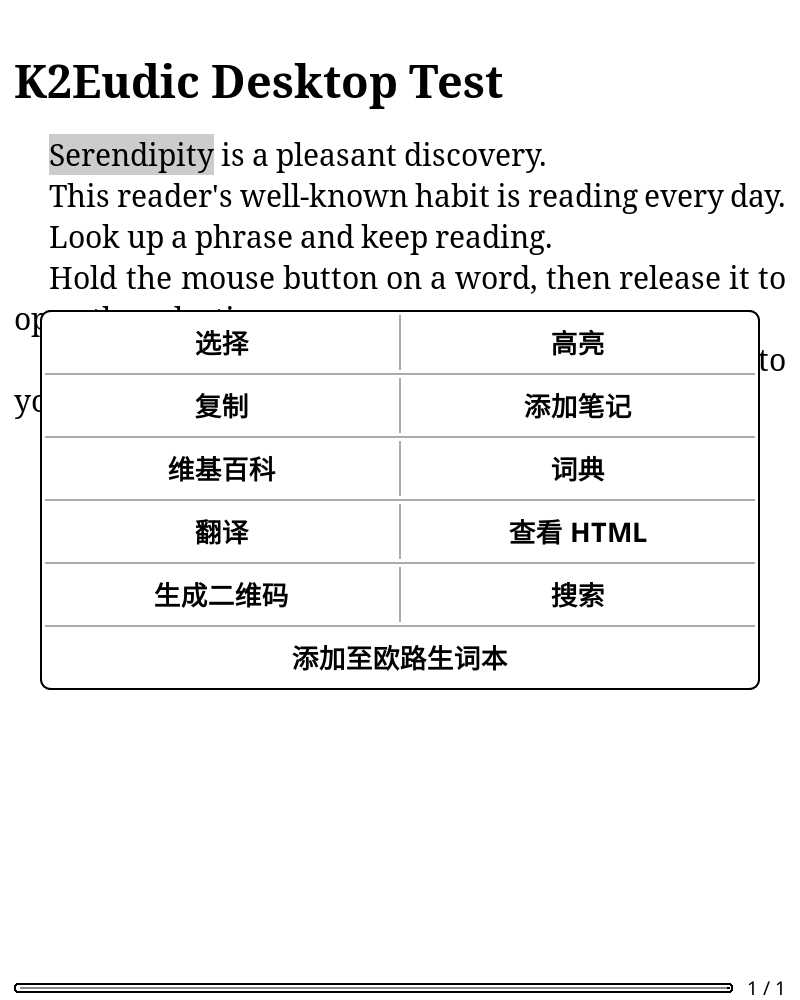
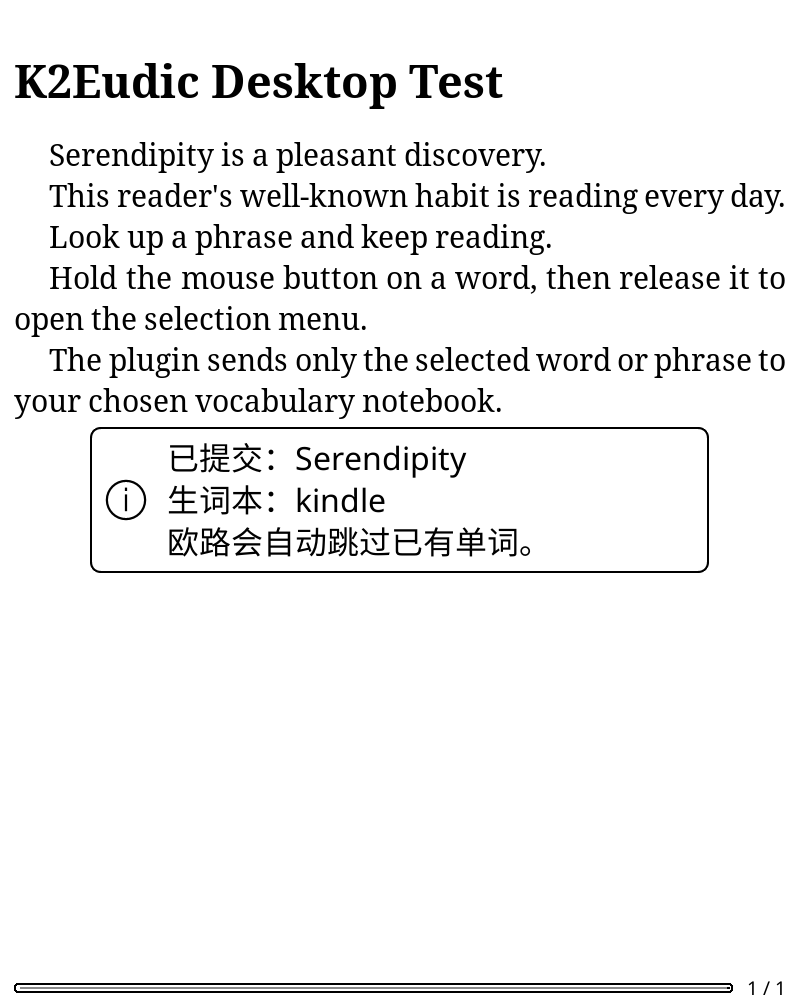

# K2Eudic · KOReader to Eudic Vocabulary

English | [简体中文](README.md)

**Long-press an English word in KOReader and add it to your chosen Eudic vocabulary notebook.**

Supports words and phrases through the official Eudic API. You do not need the Eudic app on your e-reader.

The interface follows KOReader's language setting: Chinese locales use Simplified Chinese; all other locales use English. Restart KOReader after changing its language. The screenshots below show the Chinese interface.

<p>
  
  
</p>

## 1. Install and authorize

Download and extract the plugin. The folder must be named **`k2eudic.koplugin`**.

On your computer, sign in to the [Eudic authorization page](https://my.eudic.net/OpenAPI/Authorization) and copy your personal authorization token. Inside the plugin folder, next to `main.lua`, create a UTF-8 plain text file named **`KEY`** containing one line:

```text
NIS YOUR_AUTHORIZATION_TOKEN
```

The token alone also works. Use the uppercase filename `KEY` with **no `.txt` extension**.

Copy the entire plugin folder into KOReader's `plugins/` directory, then restart KOReader. The layout should be:

```text
koreader/plugins/k2eudic.koplugin/main.lua
koreader/plugins/k2eudic.koplugin/KEY
```

Common locations are `koreader/plugins/` on Kindle and `.adds/koreader/plugins/` on Kobo. The plugin imports `KEY` automatically when no authorization has been saved. If the plugin does not appear, enable **Eudic vocabulary (K2Eudic)** in **Plugin management** under the tools menu, sometimes inside **More tools**, then restart.

**Manual entry is also available:** skip creating `KEY` and enter your token under **Eudic vocabulary → Authorization**.

## 2. Choose a notebook

Connect your device to the internet. Open **Eudic vocabulary** in the tools menu, sometimes under **More tools**, and select **Target notebook**. Choose an English vocabulary notebook from the list.

To use a new notebook, create it in Eudic first, then fetch the list again.

## 3. Long-press to add

Open an English book. In KOReader's reading settings, under **Long-press on text**:

- Select **Ask with popup dialog**.
- Uncheck **Dictionary on single word selection**.

Long-press a word, then tap **Add to Eudic vocabulary**. After **Submitted** appears, sync Eudic to see the word. Existing words are skipped automatically.

## Useful options

- **Edit before adding**: adjust the selection, for example changing `running` to `run`.
- **Add a word manually…**: type a word or phrase directly.
- **Retry last failed addition**: retry after a network failure. Only the most recent failed addition in the current session is retained.

## About the KEY file

`KEY` lets you prepare authorization on your computer before copying the plugin to your e-reader. **Saved authorization is never overwritten automatically.** After replacing `KEY`, choose **Import authorization from KEY** to update it. Select a notebook again after changing your authorization.

Once imported, authorization is saved in KOReader's settings, so **you can delete `KEY` from the device**. After choosing **Clear saved authorization**, restarting will not automatically import the remaining `KEY` again. You can still import it manually when needed.

Do not share or upload your personal `KEY`, `settings/k2eudic.lua`, or their backups. Git ignores `KEY`, but you must also remove it before manually creating an archive to share.

Requires an internet connection and selectable text. Scanned PDFs without a text layer cannot be used directly. Adding words to a real Eudic account has been verified with KOReader v2026.07.1 on desktop.

Code: [GPL-3.0-or-later](LICENSE). Bundled CA certificates: [MPL-2.0](certs/MPL-2.0.txt).
